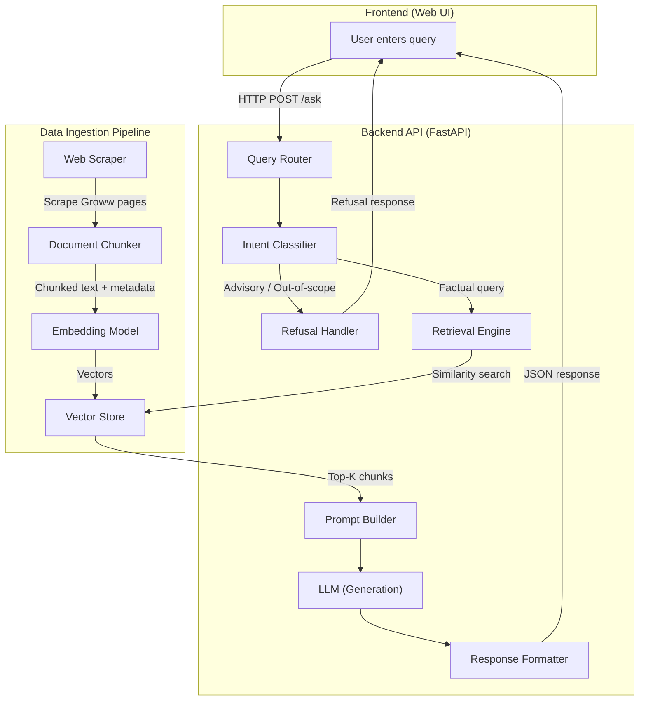
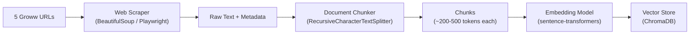
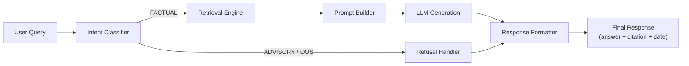
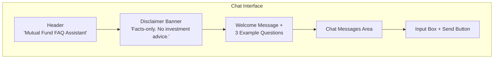
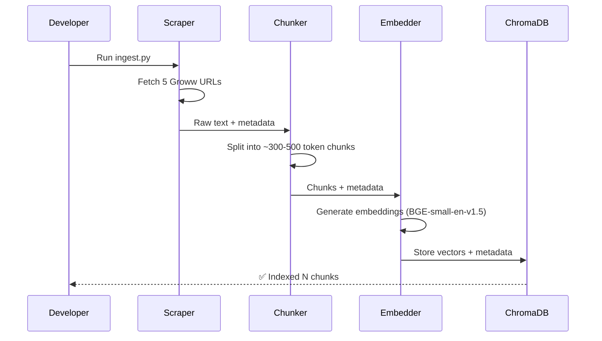
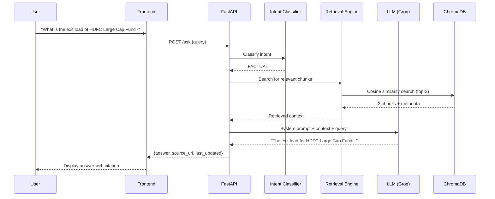
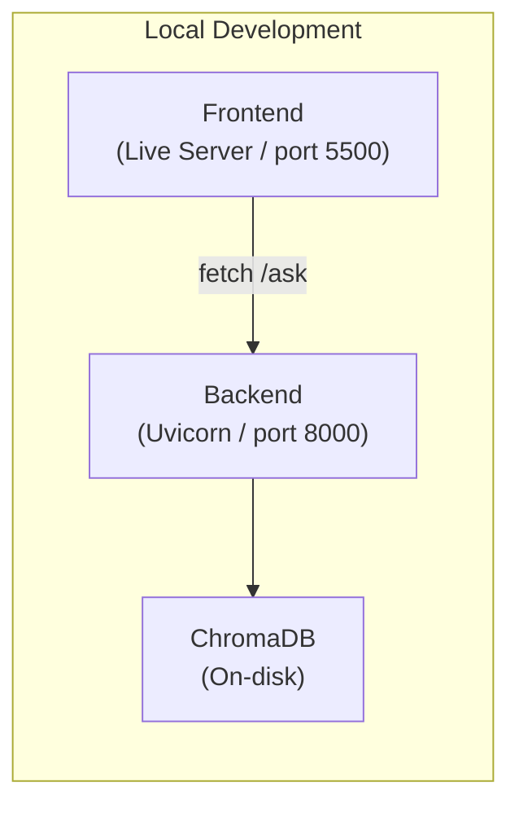

# Architecture — Mutual Fund FAQ Assistant (RAG)

## 1. High-Level Architecture

The system follows a **Retrieval-Augmented Generation (RAG)** pattern with three distinct phases: **Ingestion**, **Retrieval**, and **Generation**. A lightweight web UI connects to a backend API that orchestrates the entire pipeline.

> [!IMPORTANT]
> The **only external data sources** are the **5 Groww mutual fund scheme URLs**. There are no PDFs, no KIM/SID documents, and no AMFI/SEBI pages in the corpus. All factual data is scraped exclusively from these Groww pages.



---

## 2. Component Breakdown

### 2.1 Data Ingestion Pipeline

The ingestion pipeline runs **offline** (one-time or periodic) to build the vector knowledge base. It scrapes **only the 5 Groww scheme URLs** — no PDFs, documents, or other external sources are used.



| Step | Component | Responsibility |
|------|-----------|----------------|
| **Scrape** | `scraper.py` | Fetches HTML from the **5 Groww scheme URLs only** (no PDFs or other document sources), extracts structured text (scheme name, expense ratio, exit load, SIP amounts, benchmark, riskometer, fund manager, etc.), and attaches source metadata (URL, scrape date). |
| **Chunk** | `chunker.py` | Splits extracted text into overlapping chunks of ~300–500 tokens using `RecursiveCharacterTextSplitter`. Each chunk retains metadata: `source_url`, `scheme_name`, `section`, `scrape_date`. |
| **Embed** | `embedder.py` | Converts each chunk into a dense vector using the BGE embedding model (`BAAI/bge-small-en-v1.5`). |
| **Store** | `vector_store.py` | Persists embeddings + metadata into a ChromaDB collection on disk. Supports re-indexing when sources are re-scraped. |

#### Metadata Schema (per chunk)

```json
{
  "chunk_id": "hdfc-large-cap-003",
  "scheme_name": "HDFC Large Cap Fund – Direct Plan – Growth",
  "category": "Large Cap",
  "section": "Expense Ratio",
  "source_url": "https://groww.in/mutual-funds/hdfc-large-cap-fund-direct-growth",
  "scrape_date": "2026-07-02"
}
```

---

### 2.2 Query Processing Pipeline

When a user submits a query, the backend processes it through four stages:



#### Stage 1 — Intent Classification (`intent_classifier.py`)

Classifies the incoming query into one of three intents:

| Intent | Description | Example |
|--------|-------------|---------|
| `FACTUAL` | Objective, fact-based question about a scheme | *"What is the expense ratio of HDFC Small Cap Fund?"* |
| `ADVISORY` | Seeks investment advice, comparison, or recommendation | *"Should I invest in HDFC Large Cap?"* |
| `OUT_OF_SCOPE` | Unrelated to mutual funds or the covered schemes | *"What is the weather today?"* |

**Implementation**: A lightweight keyword + LLM-based classifier. Advisory signals include words like *"should"*, *"better"*, *"recommend"*, *"compare"*, *"worth it"*. The LLM provides a secondary classification for ambiguous queries.

#### Stage 2 — Retrieval Engine (`retrieval.py`)

- Embeds the user query using the **same** sentence-transformer model used during ingestion
- Performs a **cosine similarity search** against ChromaDB
- Returns the **top-K (K=3)** most relevant chunks along with their metadata
- Applies a **minimum similarity threshold** (e.g., 0.65) — if no chunk meets the threshold, the system returns a "no data found" response

#### Stage 3 — Prompt Builder (`prompt_builder.py`)

Constructs the final LLM prompt using a strict template:

```text
SYSTEM PROMPT:
You are a facts-only mutual fund FAQ assistant for HDFC Mutual Fund schemes
available on Groww. You must:
1. Answer ONLY using the provided context chunks.
2. Keep your answer to a MAXIMUM of 3 sentences.
3. Include EXACTLY ONE source citation link from the chunk metadata.
4. End with: "Last updated from sources: <scrape_date>"
5. NEVER provide investment advice, opinions, or recommendations.
6. If the context does not contain the answer, say so clearly.

CONTEXT:
{retrieved_chunks}

USER QUERY:
{user_query}
```

#### Stage 4 — Response Formatter (`response_formatter.py`)

Structures the LLM output into a standardised JSON response:

```json
{
  "answer": "The expense ratio of HDFC Small Cap Fund – Direct Plan is 0.65%.",
  "source_url": "https://groww.in/mutual-funds/hdfc-small-cap-fund-direct-growth",
  "last_updated": "Last updated from sources: 2026-07-02",
  "intent": "FACTUAL",
  "scheme": "HDFC Small Cap Fund"
}
```

For refused queries:

```json
{
  "answer": "I can only answer factual questions about mutual fund schemes. For investment guidance, please visit SEBI's investor education portal.",
  "source_url": "https://investor.sebi.gov.in/",
  "last_updated": null,
  "intent": "ADVISORY",
  "scheme": null
}
```

---

### 2.3 Refusal Handler (`refusal_handler.py`)

Manages non-factual queries with polite, compliant responses.

> [!NOTE]
> The educational links below are used **only in refusal responses** to redirect users. They are **not** part of the RAG corpus and are never scraped or indexed.

| Query Type | Response Template | Redirect Link (not a corpus source) |
|------------|-------------------|-------------------------------------|
| Investment advice | *"I can only provide factual information..."* | https://investor.sebi.gov.in/ |
| Fund comparison | *"I'm unable to compare funds..."* | https://www.amfiindia.com/investor-corner/knowledge-center.html |
| Return prediction | *"For performance data, please refer to the official Groww page."* | Scheme-specific Groww URL |
| Personal data request | *"I don't collect or process personal information."* | https://www.sebi.gov.in/ |

---

### 2.4 Frontend (Web UI)

A minimal, single-page chat interface.



**Key UI elements:**

| Element | Description |
|---------|-------------|
| **Header** | App title: *"Mutual Fund FAQ Assistant"* |
| **Disclaimer Banner** | Persistent banner: *"Facts-only. No investment advice."* |
| **Welcome Message** | Greeting + 3 clickable example questions |
| **Chat Area** | Scrollable message list (user + bot bubbles) |
| **Citation Badge** | Each bot response shows a clickable source link |
| **Timestamp Footer** | *"Last updated from sources: \<date\>"* below each answer |
| **Input Box** | Text input + send button |

**Example Questions (shown on first load):**

1. *"What is the expense ratio of HDFC Mid-Cap Opportunities Fund?"*
2. *"What is the exit load for HDFC Small Cap Fund?"*
3. *"What is the minimum SIP amount for HDFC Gold ETF Fund of Fund?"*

---

## 3. Tech Stack

| Layer | Technology | Purpose |
|-------|------------|---------|
| **Frontend** | HTML + CSS + JavaScript | Minimal chat UI |
| **Backend API** | Python + FastAPI | REST API, orchestration |
| **Web Scraping** | BeautifulSoup4 / Requests | Extract data from Groww pages |
| **Text Splitting** | LangChain `RecursiveCharacterTextSplitter` | Chunk documents with overlap |
| **Embeddings** | `BAAI/bge-small-en-v1.5` (via `sentence-transformers`) | Convert text → 384-dim vectors |
| **Vector Store** | ChromaDB (persistent, on-disk) | Store and query embeddings |
| **LLM** | Groq API (`llama-3.3-70b-versatile` or `mixtral-8x7b-32768`) | Generate factual answers |
| **Intent Classification** | Keyword rules + LLM fallback | Route queries |
| **Environment** | Python 3.10+, pip, `.env` | Dependency and secret management |

---

## 4. Directory Structure

```
RAG/
├── docs/
│   ├── problemStatement.md        # Project requirements
│   └── Architecture.md            # This document
│
├── data/
│   ├── raw/                       # Raw scraped HTML/text per scheme
│   └── processed/                 # Cleaned + chunked documents (JSON)
│
├── vectorstore/                   # ChromaDB persistent storage
│   └── chroma_db/
│
├── src/
│   ├── ingestion/
│   │   ├── scraper.py             # Scrape Groww scheme pages
│   │   ├── chunker.py             # Split text into chunks
│   │   ├── embedder.py            # Generate embeddings
│   │   └── vector_store.py        # ChromaDB read/write operations
│   │
│   ├── query/
│   │   ├── intent_classifier.py   # Classify query intent
│   │   ├── retrieval.py           # Similarity search over vector store
│   │   ├── prompt_builder.py      # Construct LLM prompt
│   │   ├── refusal_handler.py     # Handle advisory/OOS queries
│   │   └── response_formatter.py  # Format final JSON response
│   │
│   ├── api/
│   │   └── main.py                # FastAPI app + /ask endpoint
│   │
│   └── config.py                  # Constants, thresholds, model names
│
├── frontend/
│   ├── index.html                 # Chat UI
│   ├── style.css                  # Styles
│   └── script.js                  # API calls + DOM logic
│
├── scripts/
│   └── ingest.py                  # CLI script: scrape → chunk → embed → store
│
├── tests/
│   ├── test_scraper.py
│   ├── test_retrieval.py
│   ├── test_intent_classifier.py
│   └── test_refusal_handler.py
│
├── .env.example                   # Environment variable template
├── requirements.txt               # Python dependencies
└── README.md                      # Setup + usage guide
```

---

## 5. Data Flow — End-to-End

### 5.1 Ingestion Flow (Offline)



### 5.2 Query Flow (Online)



---

## 6. API Design

### `POST /ask`

**Request:**

```json
{
  "query": "What is the minimum SIP amount for HDFC Gold ETF FoF?"
}
```

**Response (Factual):**

```json
{
  "status": "success",
  "data": {
    "answer": "The minimum SIP amount for HDFC Gold ETF Fund of Fund – Direct Plan is ₹500.",
    "source_url": "https://groww.in/mutual-funds/hdfc-gold-etf-fund-of-fund-direct-plan-growth",
    "last_updated": "Last updated from sources: 2026-07-02",
    "intent": "FACTUAL",
    "scheme": "HDFC Gold ETF Fund of Fund"
  }
}
```

**Response (Refused):**

```json
{
  "status": "refused",
  "data": {
    "answer": "I can only provide factual information about mutual fund schemes. I'm not able to offer investment advice or recommendations. For investment guidance, please visit SEBI's investor education portal.",
    "source_url": "https://investor.sebi.gov.in/",
    "last_updated": null,
    "intent": "ADVISORY",
    "scheme": null
  }
}
```

### `GET /health`

Returns service health status and last ingestion timestamp.

---

## 7. Guardrails & Safety

| Guardrail | Implementation |
|-----------|----------------|
| **No investment advice** | Intent classifier blocks advisory queries before retrieval |
| **Max 3 sentences** | System prompt enforces limit; post-processing truncates if needed |
| **Single citation** | Prompt instructs LLM to cite one source; formatter validates |
| **No PII collection** | No input logging; no form fields for personal data |
| **Source-only answers** | LLM is instructed to answer ONLY from retrieved context |
| **Hallucination guard** | Low-similarity threshold triggers "I don't have this information" |
| **Content filter** | Regex-based filter strips any accidental advice language from output |

---

## 8. Embedding & Retrieval Strategy

| Parameter | Value | Rationale |
|-----------|-------|-----------|
| **Embedding Model** | `BAAI/bge-small-en-v1.5` | BGE family, strong retrieval accuracy, lightweight (130 MB), open-source |
| **Vector Dimensions** | 384 | Model output size |
| **Chunk Size** | 300–500 tokens | Balances context granularity with retrieval precision |
| **Chunk Overlap** | 50 tokens | Preserves context across chunk boundaries |
| **Top-K** | 3 | Sufficient for factual lookups; limits noise |
| **Similarity Threshold** | 0.65 | Below this → "information not available" response |
| **Distance Metric** | Cosine similarity | Standard for sentence embeddings |

---

## 9. Prompt Engineering

### System Prompt (Core Rules)

```text
You are a facts-only mutual fund FAQ assistant for HDFC Mutual Fund schemes
listed on Groww. Follow these rules strictly:

RULES:
1. Answer ONLY using the CONTEXT provided below. Do not use outside knowledge.
2. Keep your response to a MAXIMUM of 3 sentences.
3. Include EXACTLY ONE citation link from the source_url in the context metadata.
4. End every response with: "Last updated from sources: <date>"
5. NEVER give investment advice, recommendations, or opinions.
6. NEVER compare funds or predict returns.
7. If the context does not contain enough information to answer, respond:
   "I don't have this information in my current sources. Please check the
    official HDFC Mutual Fund website for the latest details."
```

### Refusal Prompt

```text
The user has asked an advisory or out-of-scope question. Respond politely:
1. Acknowledge the question.
2. Explain that you only answer factual questions.
3. Suggest a relevant educational resource (AMFI or SEBI link).
Keep it to 2 sentences maximum.
```

---

## 10. Known Limitations

| Limitation | Impact | Mitigation |
|------------|--------|------------|
| **Static corpus** | Data may become stale if Groww updates scheme pages | Periodic re-scraping via `ingest.py` |
| **Groww-only source** | No data from official AMC PDFs (KIM, SID, factsheets) | Sufficient for FAQ-level facts; can be extended later |
| **5 schemes only** | Cannot answer about non-HDFC or unlisted schemes | Clear refusal for out-of-scope schemes |
| **No real-time NAV** | Cannot provide live NAV or returns | Redirect to Groww for live data |
| **Web scraping fragility** | Groww page structure changes may break scraper | Modular scraper with fallback selectors |
| **LLM cost** | API calls incur per-token cost | Cache frequent queries; use smaller models |
| **Single language** | English only | Clearly stated in UI disclaimer |

---

## 11. Deployment Overview



| Component | Command |
|-----------|---------|
| **Ingest data** | `python scripts/ingest.py` |
| **Start backend** | `uvicorn src.api.main:app --reload --port 8000` |
| **Start frontend** | Open `frontend/index.html` or use Live Server |

---

## 12. Future Enhancements

- **Scheduled re-scraping** — Cron job to refresh corpus weekly
- **Multi-AMC support** — Extend to SBI, ICICI Prudential, etc.
- **Hindi / regional language support** — Multilingual embeddings + prompts
- **Conversation memory** — Follow-up questions within the same session
- **Admin dashboard** — Monitor query logs, retrieval accuracy, refusal rates
- **Caching layer** — Redis cache for frequent identical queries
