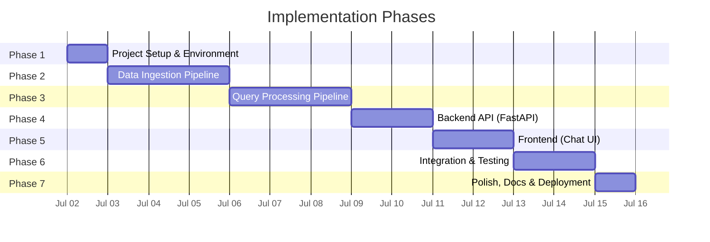
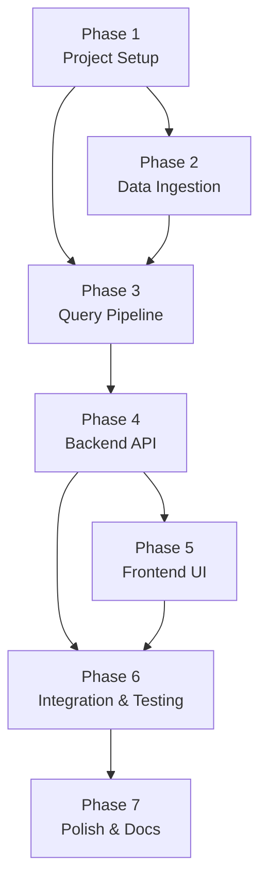

# Phase-Wise Implementation Plan — Mutual Fund FAQ Assistant (RAG)

> Based on [Architecture.md](file:///c:/Users/anshy/OneDrive/Desktop/RAG/Architecture.md) and [problemStatement.md](file:///c:/Users/anshy/OneDrive/Desktop/RAG/problemStatement.md)

---

## Phase Overview



| Phase | Name | Key Deliverable | Est. Duration |
|-------|------|-----------------|---------------|
| 1 | Project Setup & Environment | Directory structure, dependencies, config | 1 day |
| 2 | Data Ingestion Pipeline | Scraped, chunked & embedded data in ChromaDB | 3 days |
| 3 | Query Processing Pipeline | Intent classifier, retrieval, prompt builder, refusal handler | 3 days |
| 4 | Backend API | FastAPI `/ask` and `/health` endpoints | 2 days |
| 5 | Frontend (Chat UI) | Minimal chat interface with disclaimer | 2 days |
| 6 | Integration & Testing | End-to-end flow, unit tests, edge cases | 2 days |
| 7 | Polish, Docs & Deployment | README, final cleanup, local deployment | 1 day |

---

## Phase 1 — Project Setup & Environment

### Objective
Set up the project skeleton, install dependencies, and configure environment variables.

### Tasks

- [x] Create the full directory structure as defined in Architecture.md:
  ```
  RAG/
  ├── docs/
  ├── data/raw/
  ├── data/processed/
  ├── vectorstore/chroma_db/
  ├── src/ingestion/
  ├── src/query/
  ├── src/api/
  ├── frontend/
  ├── scripts/
  └── tests/
  ```
- [x] Create `requirements.txt` with all dependencies:
  ```
  fastapi
  uvicorn
  requests
  beautifulsoup4
  langchain
  langchain-text-splitters
  sentence-transformers
  chromadb
  groq                        # Groq LLM API client
  python-dotenv
  pytest
  ```
- [x] Create `.env.example` with environment variable template:
  ```
  GROQ_API_KEY=your_groq_api_key_here
  LLM_MODEL=llama-3.3-70b-versatile
  CHROMA_DB_PATH=./vectorstore/chroma_db
  EMBEDDING_MODEL=BAAI/bge-small-en-v1.5
  TOP_K=3
  SIMILARITY_THRESHOLD=0.65
  ```
- [x] Create `src/config.py` with constants, thresholds, model names, and the 5 Groww URLs
- [x] Create `__init__.py` files in all `src/` subdirectories
- [x] Verify environment: `pip install -r requirements.txt`

### Exit Criteria
- All directories exist
- Dependencies install without errors
- `config.py` loads `.env` values and exposes the 5 scheme URLs

---

## Phase 2 — Data Ingestion Pipeline

### Objective
Scrape the 5 Groww scheme pages, chunk the extracted text, generate embeddings, and store them in ChromaDB.

### Tasks

#### 2.1 — Web Scraper (`src/ingestion/scraper.py`)

- [x] Implement `scrape_scheme_page(url: str) -> dict` function
- [x] For each of the 5 Groww URLs, extract:
  - Scheme name
  - Category / sub-category
  - Expense ratio
  - Exit load
  - Minimum SIP amount
  - Minimum lump-sum amount
  - Riskometer classification
  - Benchmark index
  - Fund manager name
  - AUM (Assets Under Management)
  - NAV (current)
  - Fund house
  - Lock-in period (if applicable)
  - Any other factual fields visible on the page
- [x] Attach metadata to each scraped document:
  ```json
  {
    "source_url": "https://groww.in/mutual-funds/...",
    "scheme_name": "HDFC Large Cap Fund – Direct Plan – Growth",
    "category": "Large Cap",
    "scrape_date": "2026-07-02"
  }
  ```
- [x] Save raw scraped data to `data/raw/` as JSON (one file per scheme)
- [x] Handle scraping errors gracefully (timeouts, missing fields)

#### 2.2 — Document Chunker (`src/ingestion/chunker.py`)

- [x] Implement `chunk_documents(raw_docs: list) -> list` function
- [x] Use LangChain's `RecursiveCharacterTextSplitter`:
  - **Chunk size**: 300–500 tokens
  - **Chunk overlap**: 50 tokens
- [x] Preserve metadata on every chunk (source_url, scheme_name, section, scrape_date)
- [x] Assign unique `chunk_id` to each chunk (e.g., `hdfc-large-cap-001`)
- [x] Save processed chunks to `data/processed/` as JSON

#### 2.3 — Embedding Generator (`src/ingestion/embedder.py`)

- [x] Load `BAAI/bge-small-en-v1.5` model from `sentence-transformers`
- [x] Implement `generate_embeddings(chunks: list) -> list` function
- [x] Convert each chunk's text content into a 384-dimensional vector
- [x] Prepend the BGE instruction prefix (`"Represent this sentence: "`) for optimal embedding quality
- [x] Return list of `(chunk_text, embedding_vector, metadata)` tuples

#### 2.4 — Vector Store (`src/ingestion/vector_store.py`)

- [x] Initialize ChromaDB persistent client at `vectorstore/chroma_db/`
- [x] Create (or get) a collection named `mutual_fund_faq`
- [x] Implement `index_chunks(chunks_with_embeddings: list)` — upsert into ChromaDB
- [x] Implement `clear_collection()` — for re-indexing
- [x] Implement `get_collection_stats()` — return count of indexed chunks

#### 2.5 — Ingestion CLI Script (`scripts/ingest.py`)

- [x] Wire all four steps: scrape → chunk → embed → store
- [x] Add logging (number of pages scraped, chunks created, vectors stored)
- [x] Print summary on completion:
  ```
  ✅ Ingestion complete
  Pages scraped: 5
  Chunks created: N
  Vectors indexed: N
  ```

### Exit Criteria
- Running `python scripts/ingest.py` successfully scrapes all 5 URLs
- ChromaDB contains indexed chunks with correct metadata
- `data/raw/` and `data/processed/` contain saved outputs

---

## Phase 3 — Query Processing Pipeline

### Objective
Build the modules that classify user intent, retrieve relevant chunks, construct LLM prompts, handle refusals, and format responses.

### Tasks

#### 3.1 — Intent Classifier (`src/query/intent_classifier.py`)

- [ ] Implement `classify_intent(query: str) -> str` function
- [ ] Return one of three intents: `FACTUAL`, `ADVISORY`, `OUT_OF_SCOPE`
- [ ] **Rule-based layer** (primary):
  - Advisory keywords: `should`, `better`, `recommend`, `compare`, `worth`, `invest`, `suggest`, `prefer`, `which one`, `good fund`
  - Out-of-scope signals: no mutual fund terms detected
- [ ] **LLM fallback** (secondary): for ambiguous queries, use a single LLM call with a classification prompt
- [ ] Write test cases for all three intent types

#### 3.2 — Retrieval Engine (`src/query/retrieval.py`)

- [ ] Implement `retrieve_chunks(query: str, top_k: int = 3) -> list` function
- [ ] Embed the user query using `BAAI/bge-small-en-v1.5` (same model as ingestion)
- [ ] Query ChromaDB with cosine similarity search
- [ ] Return top-K chunks with metadata and similarity scores
- [ ] Apply **minimum similarity threshold** (0.65) — if all results fall below, return empty list
- [ ] Handle edge case: empty vector store

#### 3.3 — Prompt Builder (`src/query/prompt_builder.py`)

- [ ] Implement `build_prompt(query: str, chunks: list) -> str` function
- [ ] Construct the system prompt as defined in Architecture.md Section 9:
  - Facts-only constraint
- [x] Implement `build_prompt(query: str, retrieved_chunks: list) -> tuple[str, str]`
- [x] Inject system rules (max 3 sentences, exactly 1 citation, no advice)
- [x] Append raw text of retrieved chunks into the prompt context

#### 3.4 — Refusal Handler (`src/query/refusal_handler.py`)

- [x] Implement `generate_refusal(query: str, intent: str) -> dict`
- [x] Return polite refusal message for `ADVISORY` intent
- [x] Return generic out-of-bounds message for `OUT_OF_SCOPE` intent
- [x] Append educational resource link (e.g., SEBI or AMFI investor education pages)

#### 3.5 — LLM Client (`src/query/llm_client.py`)

- [x] Initialize `groq.Groq(api_key=...)` client
- [x] Implement `call_llm(prompt: str) -> str` function
- [x] Use strictly `temperature=0.0` for factual accuracy
- [x] Set `max_tokens=200` to prevent long responses (max 3 sentences)
- [x] Implement robust error handling and retry logic (e.g., using `tenacity`):
  - Handle `llama-3.3-70b-versatile` rate limits (30 RPM, 1K RPD, 12K TPM, 100K TPD)
  - Retry on HTTP 429 (Rate Limit) with exponential backoff
  - Fallback to `mixtral-8x7b-32768` if limits are continually exhausted
- [x] Handle invalid API keys and timeouts gracefully

#### 3.6 — Response Formatter (`src/query/response_formatter.py`)

- [ ] Validate: answer ≤ 3 sentences, exactly 1 source URL present
- [ ] Post-processing: strip any accidental advisory language

### Exit Criteria
- Each module works independently with unit tests
- Full pipeline: query → classify → retrieve → prompt → LLM → format → JSON response
- Advisory queries return polite refusals with redirect links

---

## Phase 4 — Backend API (FastAPI)

### Objective
Expose the query pipeline as a REST API with two endpoints.

### Tasks

#### 4.1 — FastAPI Application (`src/api/main.py`)

- [x] Initialize FastAPI app with title, description, and version
- [x] Enable CORS middleware (for frontend → backend communication)
- [x] Load vector store on startup (`@app.on_event("startup")`)

#### 4.2 — `POST /ask` Endpoint

- [x] Accept request body: `{ "query": "string" }`
- [x] Validate input (non-empty query, max length 500 chars)
- [x] Pipeline orchestration:
  1. Classify intent
  2. If `ADVISORY` or `OUT_OF_SCOPE` → return refusal
  3. If `FACTUAL` → retrieve chunks → build prompt → call LLM → format response
- [x] Return structured JSON response
- [x] Handle errors: return `500` with error message if pipeline fails

#### 4.3 — `GET /health` Endpoint

- [x] Return:
  ```json
  {
    "status": "healthy",
    "vector_store_chunks": 42,
    "last_ingestion": "2026-07-02"
  }
  ```

#### 4.4 — Request/Response Models (`src/api/models.py`)

- [x] Define Pydantic models:
  - `QueryRequest` — `query: str`
  - `QueryResponseData` — `answer`, `source_url`, `last_updated`, `intent`, `scheme`
  - `QueryResponse` — `status`, `data: QueryResponseData`
  - `HealthResponse` — `status`, `vector_store_chunks`, `last_ingestion`

### Exit Criteria
- `uvicorn src.api.main:app --reload --port 8000` starts without errors
- `POST /ask` returns correct JSON for factual queries
- `POST /ask` returns refusal JSON for advisory queries
- `GET /health` returns store stats

---

## Phase 5 — Frontend (Chat UI)

### Objective
Build a minimal, polished chat interface that connects to the backend API.

### Tasks

#### 5.1 — HTML Structure (`frontend/index.html`)

- [x] Page title and meta tags (SEO basics)
- [x] Header: *"Mutual Fund FAQ Assistant"*
- [x] Disclaimer banner: *"Facts-only. No investment advice."*
- [x] Welcome message container
- [x] 3 clickable example questions:
  1. *"What is the expense ratio of HDFC Large Cap Fund?"*
  2. *"What is the minimum SIP amount?"*
  3. *"What is the exit load for HDFC Small Cap Fund?"*
- [x] Chat messages container (scrollable)
- [x] Input area: text input + send button
- [x] Link to `style.css` and `script.js`

#### 5.2 — Styling (`frontend/style.css`)

- [x] Dark/premium theme with modern colour palette
- [x] Chat bubble styles (user vs. bot)
- [x] Citation badge styling (clickable source link)
- [x] "Last updated" footer below bot messages
- [x] Disclaimer banner styling (persistent, subtle)
- [ ] Smooth scroll for chat area
- [x] Smooth scroll for chat area
- [x] Responsive layout (mobile-friendly)
- [x] Loading animation (typing indicator while waiting for API)
- [x] Hover effects on example questions and send button
- [x] Google Font (e.g., Inter or Outfit)

#### 5.3 — JavaScript Logic (`frontend/script.js`)

- [x] `sendQuery(query)` → `POST /ask` to backend
- [x] `appendMessage(role, content, metadata)` → add bubble to chat area
- [x] Click handlers for example question buttons
- [x] Enter key handler for input box
- [x] Display citation link as a clickable badge in bot messages
- [x] Display "Last updated from sources: \<date\>" footer
- [x] Show typing indicator while waiting for response
- [x] Auto-scroll to latest message
- [x] Handle API errors gracefully (show error message in chat)
- [x] Hide welcome message + examples after first query

### Exit Criteria
- Chat UI renders correctly in browser
- Example questions are clickable and trigger API calls
- Bot responses show answer + citation link + last updated date
- Disclaimer banner is always visible
- Responsive on mobile viewports

---

## Phase 6 — Integration & Testing

### Objective
Verify the full end-to-end flow and ensure all edge cases are handled.

### Tasks

#### 6.1 — End-to-End Testing

- [x] Run full flow: start backend → open frontend → ask factual question → verify response
- [x] Test all 5 schemes with at least 2 queries each:

  | Scheme | Sample Query 1 | Sample Query 2 |
  |--------|---------------|----------------|
  | HDFC Large Cap Fund | Expense ratio? | Benchmark index? |
  | HDFC Mid-Cap Opportunities Fund | Minimum SIP amount? | Fund manager? |
  | HDFC Small Cap Fund | Exit load? | Riskometer classification? |
  | HDFC Gold ETF FoF | Minimum lump-sum amount? | Category? |
  | HDFC Silver ETF FoF | AUM? | Expense ratio? |

#### 6.2 — Refusal Testing

- [x] Test advisory queries:
  - *"Should I invest in HDFC Large Cap Fund?"*
  - *"Which is better — HDFC Mid Cap or Small Cap?"*
  - *"Will this fund give good returns?"*
- [x] Verify polite refusal with redirect link
- [x] Test out-of-scope queries:
  - *"What is the weather today?"*
  - *"Tell me about SBI Bluechip Fund"*

#### 6.3 — Edge Case Testing

- [ ] Empty query → validation error
- [ ] Very long query (>500 chars) → truncation or rejection
- [ ] Query with PII (e.g., *"My PAN is ABCDE1234F, check my balance"*) → refusal, no logging
- [ ] Misspelled scheme name → closest match or graceful "not found"
- [ ] Backend down → frontend shows error message

#### 6.4 — Unit Tests (`tests/`)

- [ ] `test_scraper.py` — verify data extraction from sample HTML
- [ ] `test_intent_classifier.py` — verify classification for all three intents
- [ ] `test_retrieval.py` — verify chunk retrieval with mock ChromaDB
- [ ] `test_refusal_handler.py` — verify refusal responses
- [ ] Run all tests: `pytest tests/ -v`

#### 6.5 — Guardrail Validation

- [ ] Verify: responses are ≤ 3 sentences
- [ ] Verify: exactly 1 citation link per response
- [ ] Verify: "Last updated from sources" footer present
- [ ] Verify: no advisory language in any factual response
- [ ] Verify: no PII stored in any log or database

### Exit Criteria
- All unit tests pass
- All 5 schemes return accurate answers
- Advisory queries are consistently refused
- No guardrail violations detected

---

## Phase 7 — Polish, Documentation & Deployment

### Objective
Finalize documentation, clean up code, and prepare for local deployment.

### Tasks

#### 7.1 — README.md

- [ ] Project overview and objective
- [ ] Selected AMC and schemes (with links)
- [ ] Architecture overview (link to Architecture.md)
- [ ] Setup instructions:
  1. Clone repo
  2. Install dependencies
  3. Set up `.env`
  4. Run ingestion
  5. Start backend
  6. Open frontend
- [ ] Example usage with screenshots
- [ ] Known limitations
- [ ] Disclaimer: *"Facts-only. No investment advice."*

#### 7.2 — Code Cleanup

- [ ] Add docstrings to all functions
- [ ] Remove debug `print()` statements
- [ ] Consistent code formatting (run `black` or `autopep8`)
- [ ] Add type hints to all function signatures

#### 7.3 — Final Verification

- [ ] Fresh install test: clone → install → ingest → run → query
- [ ] Verify all files are committed and no secrets in repo
- [ ] Verify `.env` is in `.gitignore`

### Exit Criteria
- README is complete and accurate
- Fresh setup from scratch works without issues
- Code is clean, documented, and well-structured

---

## Dependency Graph



> [!NOTE]
> **Phase 2 and Phase 3** can be partially parallelised — the retrieval engine (Phase 3.2) depends on the vector store (Phase 2.4), but the intent classifier (Phase 3.1), refusal handler (Phase 3.4), and prompt builder (Phase 3.3) can be built independently.

---

## Summary

| Phase | Files Created / Modified |
|-------|--------------------------|
| 1 | `requirements.txt`, `.env.example`, `src/config.py`, `__init__.py` files |
| 2 | `src/ingestion/scraper.py`, `chunker.py`, `embedder.py`, `vector_store.py`, `scripts/ingest.py` |
| 3 | `src/query/intent_classifier.py`, `retrieval.py`, `prompt_builder.py`, `refusal_handler.py`, `llm_client.py`, `response_formatter.py` |
| 4 | `src/api/main.py`, `src/api/models.py` |
| 5 | `frontend/index.html`, `frontend/style.css`, `frontend/script.js` |
| 6 | `tests/test_scraper.py`, `test_intent_classifier.py`, `test_retrieval.py`, `test_refusal_handler.py` |
| 7 | `README.md` |
